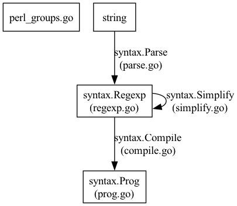

[go@go1.21.6 の regexp パッケージ](https://cs.opensource.google/go/go/+/refs/tags/go1.21.6:src/regexp/) を読む。

## regexp/syntax
依存関係は以下。なおデータ型の変換を担当する関数・ファイルは辺で表している。


それぞれのファイルの簡単な説明は以下。

- regexp.go: 型 syntax.Regexp を公開する。
- prog.go: 型 syntax.Prog を公開する。
- parse.go: 正規表現の文字列を syntax.Regexp に変換する。また型 charGroup を定義する。
- simplify.go: syntax.Regexp の単純化を担当する。
- perl_groups.go: Perl 互換用のグループ (charGroup) を定義する。
- compile.go: syntax.Regexp を syntax.Prog に変換する。

### regexp.go
型 syntax.Regexp を公開する。

syntax.Regexp は以下のような型である (https://cs.opensource.google/go/go/+/refs/tags/go1.21.6:src/regexp/syntax/regexp.go;l=16-27):
```go
// A Regexp is a node in a regular expression syntax tree.
type Regexp struct {
	Op       Op // operator
	Flags    Flags
	Sub      []*Regexp  // subexpressions, if any
	Sub0     [1]*Regexp // storage for short Sub
	Rune     []rune     // matched runes, for OpLiteral, OpCharClass
	Rune0    [2]rune    // storage for short Rune
	Min, Max int        // min, max for OpRepeat
	Cap      int        // capturing index, for OpCapture
	Name     string     // capturing name, for OpCapture
}
```

Sub0 は Sub が短い場合のための backing array である。以下のようなパターンがよく見られる:
```go
re.Sub = re.Sub0[:0]
re.Sub = append(re.Sub, 値)
...
```
このとき、re.Sub の長さが 1 以下であれば、re.Sub0 が re.Sub の backing array となり、余分なメモリー確保が減らせる。(参考: [Go Slices: usage and internals](https://go.dev/blog/slices-intro))

Rune と Rune0 も同様。

### prog.go

型 syntax.Prog を公開する。

syntax.Prog は以下のような型である (https://cs.opensource.google/go/go/+/refs/tags/go1.21.6:src/regexp/syntax/prog.go;l=17-22):
```go
// A Prog is a compiled regular expression program.
type Prog struct {
	Inst   []Inst
	Start  int // index of start instruction
	NumCap int // number of InstCapture insts in re
}
```

syntax.Inst は命令を表す。
命令の例を挙げる。
- InstAlt: https://qiita.com/kobae964/items/81058a229dced09dd2ab#vm の split に相当。実行を分岐する。
- InstMatch: この命令を実行したらマッチしたことになる。
- InstFail: この命令を実行したらマッチしなかったことになる。
- InstRune, InstRune1: https://qiita.com/kobae964/items/81058a229dced09dd2ab#vm の char に相当。文字を 1 文字読み適切な文字かどうか検査する。適切でなければ失敗する。

これらの命令の解釈は (regexp/)exec.go で与えられる。

### parse.go
正規表現の文字列を syntax.Regexp に変換する。また型 charGroup を定義する。

正規表現はほとんど LL(1) (直観: 1 文字読めば構文木のトップレベルの要素がわかる) 文法なので、以下の要領で構文解析ができる。

- 構文解析の要素にあたる関数を `func Elem(t string) (value 値の型, rest string, err error)` で定義する。
- このように、文法に従って再帰的に構文解析するパーサーを作る。
  ```go
  func Expr(t string) (e *expr, rest string, err error) {
    if t[0] == '+' {
        val, rest, err := UnaryPlus(t)
        if err != nil {
            return nil, "", err
        }
        t = rest
        return ..., t, nil
    }
    ...
  }
  ```

ファイル内の大まかな処理の内容は以下の通り:

- [L14-L124](https://cs.opensource.google/go/go/+/refs/tags/go1.21.6:src/regexp/syntax/parse.go;l=14-124): 型や定数の定義。
- [L126-L289](https://cs.opensource.google/go/go/+/refs/tags/go1.21.6:src/regexp/syntax/parse.go;l=126-289): parser 自体の定義と便利メソッド。
- [L291-L575](https://cs.opensource.google/go/go/+/refs/tags/go1.21.6:src/regexp/syntax/parse.go;l=291-575): parser 内部の stack を扱うメソッド。
- [L577-L883](https://cs.opensource.google/go/go/+/refs/tags/go1.21.6:src/regexp/syntax/parse.go;l=577-883): parser 内部で使う便利メソッド。
- [L885-L1823](https://cs.opensource.google/go/go/+/refs/tags/go1.21.6:src/regexp/syntax/parse.go;l=885-1823): syntax.Parse の本丸。`(値 値の型, rest string, err error)` を返す関数が多い。
  - [L1573-L1823](https://cs.opensource.google/go/go/+/refs/tags/go1.21.6:src/regexp/syntax/parse.go;l=1573-1823): classGroup の定義および文字類 (class) のパースを行う。
- [L1825-L2115](https://cs.opensource.google/go/go/+/refs/tags/go1.21.6:src/regexp/syntax/parse.go;l=1825-2115): 文字類 (class) を扱う関数。

### compile.go
TODO
